# 获取Cookie
```javascript
var cookie=document.cookie;var ask=confirm('Cookie:'+cookie+'\n\nDo you want to copy the cookie to the clipboard?');if(ask==true){copy(cookie);msg=cookie}else{msg='Cancel'}
```


# 使用
两个子程序
## 签到

编译
```shell
make sign
```
需要获取`https://api-takumi.miyoushe.com`和`https://api-takumi.mihoyo.com`下的Cookie，后续再优化逻辑
获取后填写到conf/config.yml中
```yaml
aliyun_auth:
    access_key: ""
    secret_key: ""
miyoushe_cookie: stuid=xxxx;stoken=xxx
mihoyo_cookie: account_id_v2=xxxx; cookie_token_v2=xxxx

```
然后运行./sign即可

## 绝区零工具箱

### 驱动盘解析

该模块通过OCR识别，解析游戏中的驱动盘，保存至数据库，用于后续的计算。

先下载OCR识别库，将他解压到当前目录下

https://github.com/lz520520/zzz_helper/releases/download/Tesseract-OCR/Tesseract-OCR.7z

目录结构如下

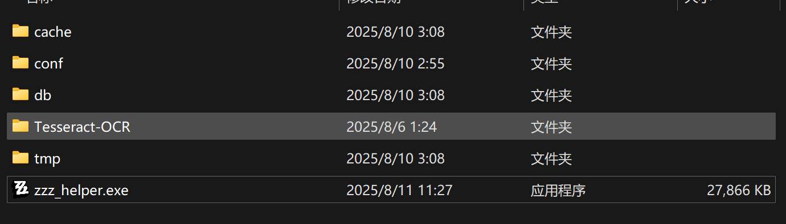

游戏中截图，可保存为图片拖拽到指定位置，或者直接`ctrl+V`粘贴，支持多张图片解析

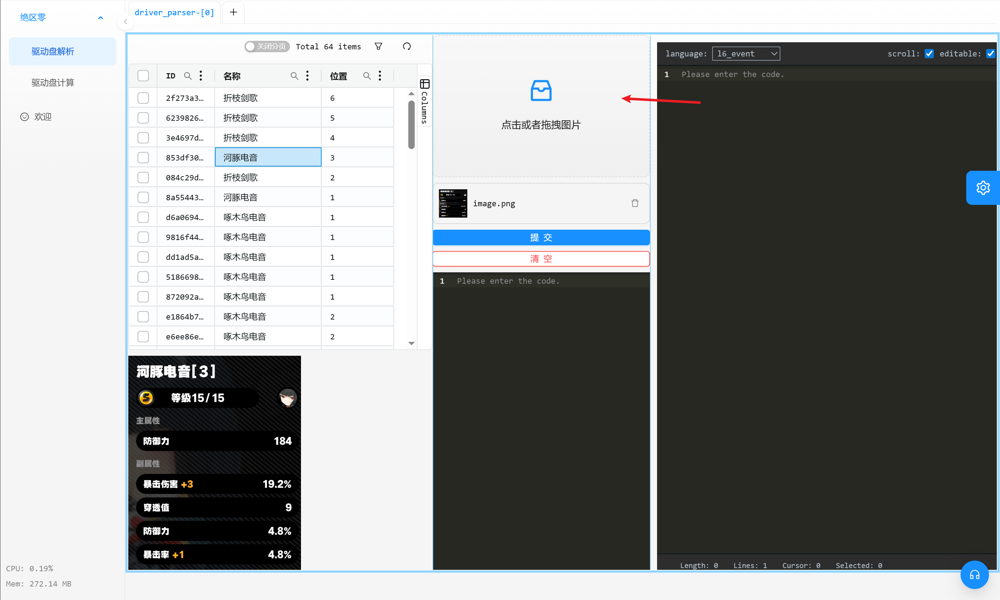

截图尽量参考如下范围

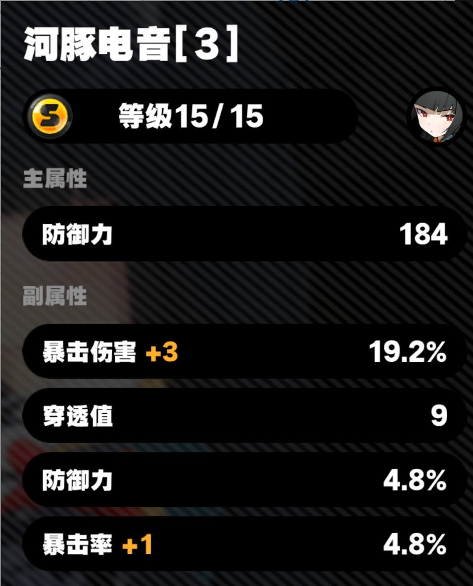

提交后如果返回`解析结果`即表示解析成功。同一张驱动盘只会保存一次，多次解析不会覆盖

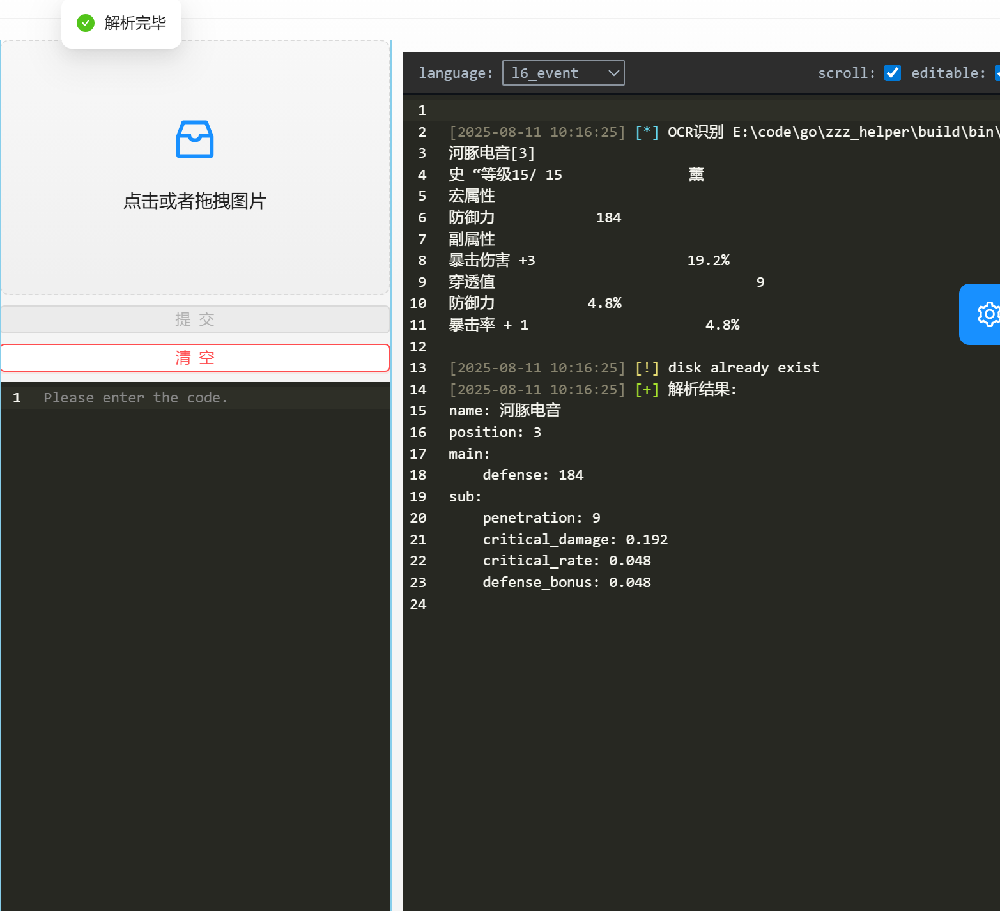

解析后则可在左侧刷新后查看，支持删除和查看详情。

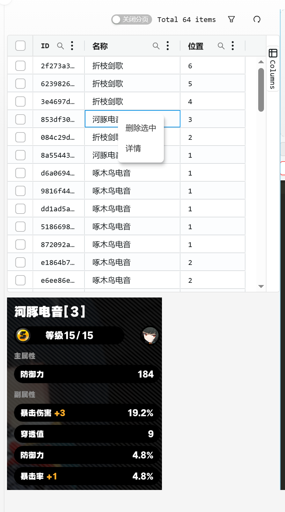


### 解析错误情况

由于使用的是一个开源的OCR程序，可能会出现识别不准确的问题，如下会提示错误识别的位置

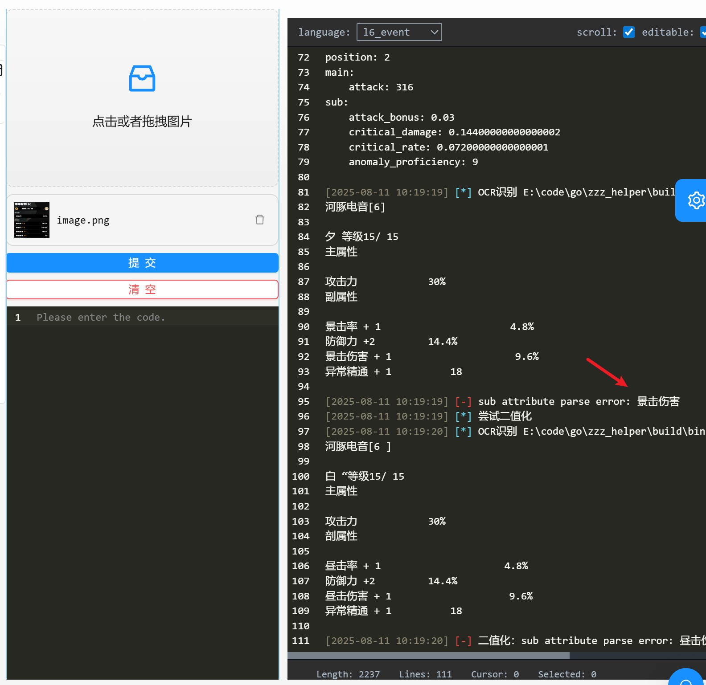

此时可以将OCR结果复制到`提交按钮`下方的文本区域，手动修复错误解析，然后重新提交即可。

注意事项：上传的图片别删除，还需要缓存该图片。

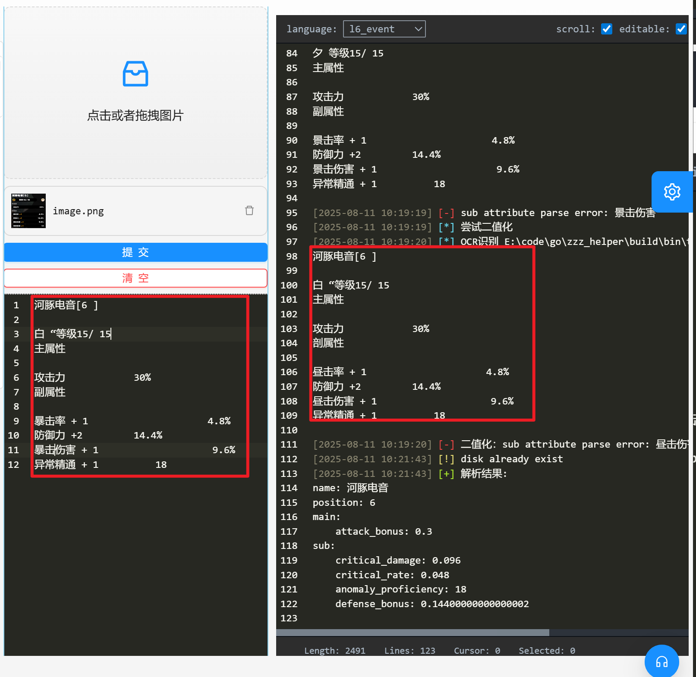


### 驱动盘计算

基于`驱动盘解析`中的驱动盘，通过遍历所有驱动盘，计算最优的套装。

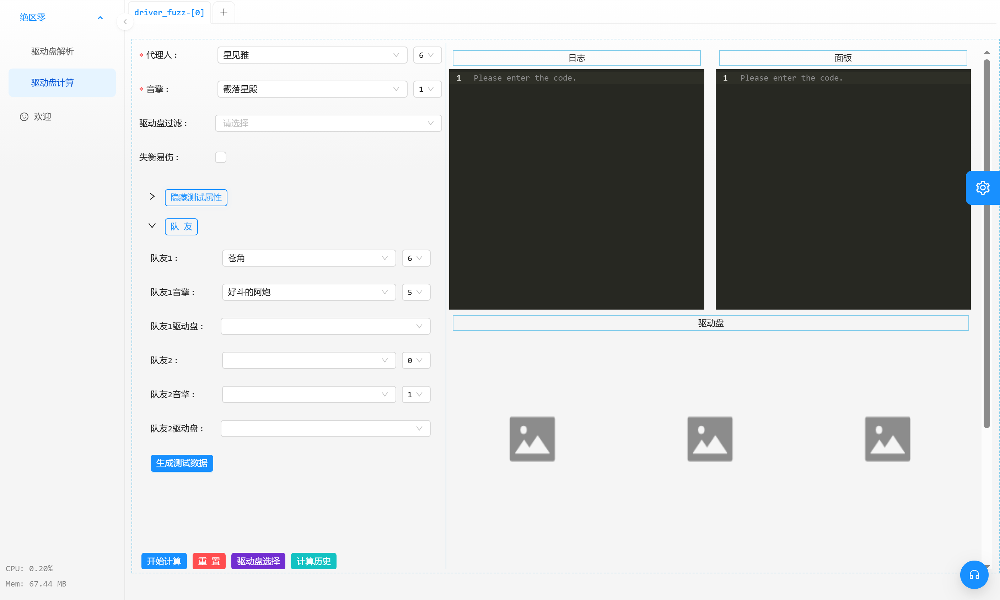

如果需要队友BUFF，可以选择队友、音擎、驱动盘，然后点击`生成测试数据`，此时会生成测试属性，生成后也可手动调整

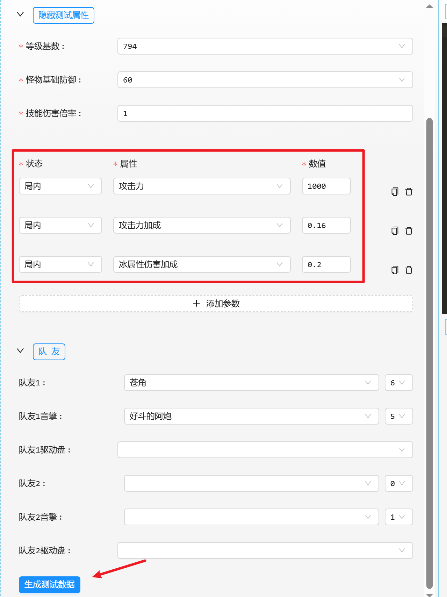

点击开始计算，就开始遍历所有驱动盘，遍历后显示计算后的面板数据

这里可以看到，暴击72.2%、爆伤147.6%，这是因为星见雅73满爆（2影+15%，折枝剑歌4件套+12%），符合理论。因为带了苍角和阿炮，所以攻击力要求就低了，局内最终攻击为4200，爆伤227%,也符合理论配平要求。

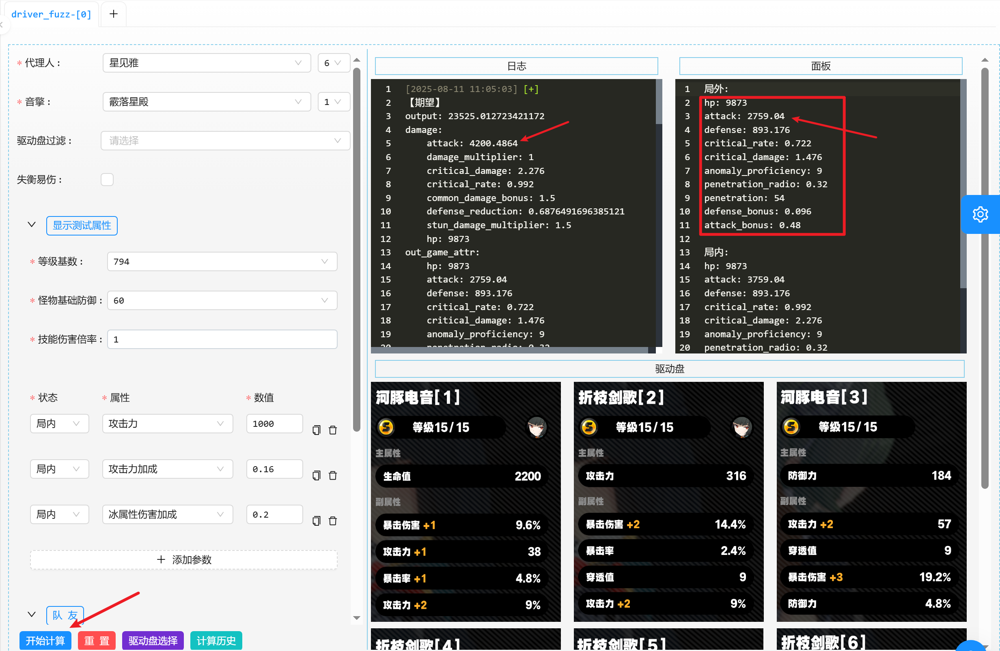


如果只想计算特定驱动盘，可以通过驱动盘过滤套装，或者点击`驱动盘选择`，选中想计算的驱动盘（如果不选择则表示全部）

这里比较灵活，适配不同需求场景，比如我不想将艾莲用的驱动盘也纳入计算。

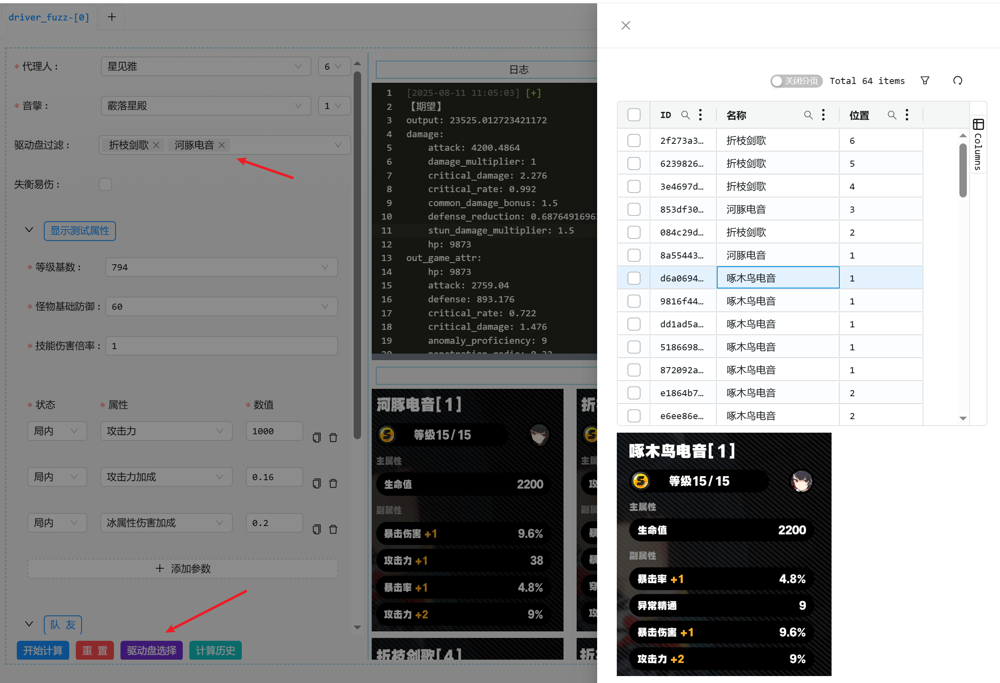


如果想查看之前的计算结果，可以点击`计算历史`，找到想查看的历史，双击，就可以在当前界面展示

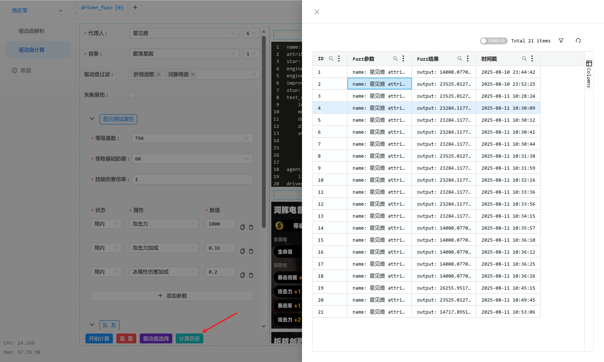

获取历史后，日志里会显示之前Fuzz提交的参数信息，面板则是详细的计算结果，并且会展示驱动盘图片信息。

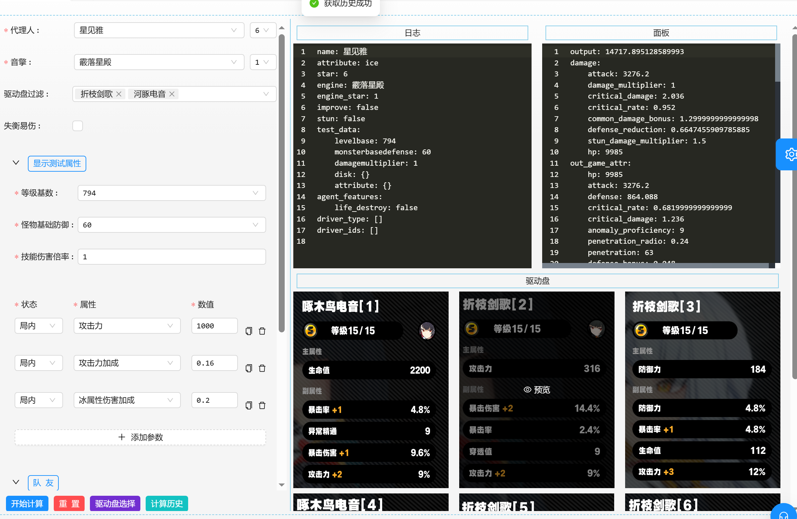

## ~~驱动盘分析(废弃)~~

目前只做了截图提取驱动盘信息，代理人分析放在miyabi_test.go这种里面临时测试，后续再完善。

并且ocr使用的是阿里云的API，需要填写AK/SK到conf/config.yml
```yaml
aliyun_auth:
    access_key: "xxx"
    secret_key: "xxx"
```

```shell
# 编译
make parser

# 提取驱动盘截图里的信息
./parser ocr -f test/test2/Snipaste_2025-01-19_00-34-28.png
./parser ocr -f test/test2

# 如果存在某些识别结果解析失败，可手动调整然后解析
./parser ocr2 -c "河豚电音[5] 5 等级15/15 主属性 穿透率 24% 副属性 防御力 +2 45 穿透值 +2 27 攻击力 +1 38 异常精通 9"
```